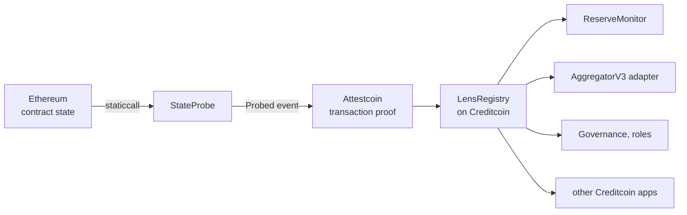

# Lens

### Verified cross-chain contract reads for Creditcoin.

Creditcoin can prove that an Ethereum transaction happened.
Lens lets it verify what an Ethereum contract returned.

**Live explorer:** <https://lens.54-154-121-30.sslip.io> · mirror: <https://jennycruzy.github.io/lens/>
· CC3 testnet · Ethereum mainnet and Sepolia sources · 200 Foundry tests · MIT

Attestcoin proves transaction inclusion and events. Many cross-chain questions are not
transactions:

- What are this vault's reserves?
- What was this account's voting weight at block N?
- Does this address hold this role?
- What did this checkpointed exchange-rate function return?

Lens performs the read on the source-chain EVM, emits the result, and proves that event
to Creditcoin through Attestcoin. **The source chain computes the answer. The prober only
decides when to ask.**



Lens is not another application built on Attestcoin. It is a reusable read layer for
applications built on Attestcoin: one feed can serve many consumers, and one integration
expands the data available to all of them.

## Live demo

<https://lens.54-154-121-30.sslip.io>

The page reads Creditcoin and the source chains directly in your browser — there is no
server and nothing cached. Pick a feed, watch the four stages, and press **Verify** to
re-run the same call at the proven block and compare the bytes yourself. Sepolia feeds
recheck live on public RPCs; Ethereum mainnet feeds need an archive endpoint to recheck
historically and the page says so rather than showing a false result.

## Why Lens exists

Attestcoin already gives Creditcoin contracts cryptographic evidence about transactions
and events on supported chains. Lens extends that model to read-only contract queries by
turning the EVM's answer into an attestable event.

| Attestcoin natively proves | Lens lets a contract verify |
|---|---|
| this transaction was included | what did this view function return? |
| this event was emitted | what were this vault's reserves? |
| this payment happened | what was voting power at block N? |
| | does this address hold this role? |
| | what is this checkpointed exchange rate? |

No protocol upgrade is required. There are no storage proofs here and none are claimed:
the contract answers, the answer is emitted, the emission is proven.

## How one proof works

1. **Source read.** `StateProbe` on Ethereum staticcalls the target with the caller's
   calldata and emits `Probed(target, callHash, …, blockNumber, blockTimestamp, returnData)`.
   The EVM produced the bytes; the prober supplied only the question.
2. **Attestation.** Creditcoin's validators attest the source chain. The frontier trails
   the head by 30–40 blocks, measured.
3. **Proof.** A prober submits the transaction's Merkle and continuity proofs to
   `LensRegistry`, which verifies them through the BlockProver precompile and then runs
   its own six checks (receipt status, single use, attested range, newest wins, chain key
   bound to native chain id, registered emitter).
4. **Consumption.** The registry stores the bytes with the source block and the source
   clock. Consumers read with a freshness bound in source blocks and are refused — with a
   distinct error — when the value is missing, failed, truncated or stale.

The security sentence: **the caller can choose when to ask. It cannot choose the answer.**
A forged probe fails at the precompile. A withheld probe makes the feed stale, and stale
is refused.

## Live deployments

| Contract | Chain | Address |
|---|---|---|
| `LensRegistry` | Creditcoin CC3 testnet | [`0x5c5bEE8b3D942cB7782071e13A272C7AE9f7C907`](https://creditcoin-testnet.blockscout.com/address/0x5c5bEE8b3D942cB7782071e13A272C7AE9f7C907) |
| `LensAggregatorV3` | Creditcoin CC3 testnet | [`0x134dbefE46b803ADab301D3c85f33E82a16A3993`](https://creditcoin-testnet.blockscout.com/address/0x134dbefE46b803ADab301D3c85f33E82a16A3993) |
| `ReserveMonitor` · `LensMarket` · `VotePort` · `SnapshotProver` · `CircuitBreaker` · `FeedEscrow` | Creditcoin CC3 testnet | [`docs/EVIDENCE.md`](docs/EVIDENCE.md) |
| `StateProbe` | Ethereum mainnet | [`0x81b6DcbcE28EC0634DC905cfDc5eA84005915852`](https://etherscan.io/address/0x81b6DcbcE28EC0634DC905cfDc5eA84005915852) |
| `StateProbe` | Ethereum Sepolia | [`0x4AD27A0b32c0D2aA0ebf96D7F1F74810093be115`](https://sepolia.etherscan.io/address/0x4AD27A0b32c0D2aA0ebf96D7F1F74810093be115) |

Every current deployment matches the checked-in bytecode (`node tools/check-deployed.mjs`),
all eleven CC3 contracts and both probes are source-verified, and [`deployments.json`](deployments.json)
is the single committed list the tools and the web page read from.

**CC3 testnet attests Ethereum mainnet**, so a testnet deployment reads real mainnet
state: the stETH exchange rate, ENS's historical voting supply and a Uniswap observation
are proven feeds today. Chain keys differ per environment (Ethereum mainnet is key 3
here), so the registry resolves and asserts them at construction rather than hardcoding
them.

## What Lens is good for

Verified cross-chain state for values whose meaning survives finality:

- liquid-staking exchange rates
- reserve and backing checkpoints, total supply
- historical governance weight
- access-control roles and pause flags
- time-averaged inputs such as a 30-minute Uniswap observation
- any checkpointed value a contract keeps itself

## What Lens is not good for

The measured attestation lag is seven to eight minutes. Lens is the wrong tool for an
instantaneous AMM quote, a perp mark price, a block-sensitive liquidation engine or a
sub-minute trading signal. It does not create storage proofs, so a contract that keeps
no history cannot be asked about its past. A value whose original source is Chainlink
keeps Chainlink's trust assumptions when Lens carries it; what Lens removes is the need
for an additional trusted cross-chain reporter or bridge.

Fuller, and blunter: [`docs/LIMITS.md`](docs/LIMITS.md).

## Security model

A prober is trusted for liveness, never correctness. Correctness comes from the
source-chain EVM and the proof; the registry adds six checks, each with an adversarial
test that hands it a *valid* proof and confirms it still refuses. There is no owner, no
pause key and no upgrade path in any Lens contract. Age is measured in source-chain
blocks against the attested frontier, never wall-clock. The full model, the attacks
considered and the two-clocks problem: [`docs/SECURITY.md`](docs/SECURITY.md).

## Try it

Without cloning anything:

```
cast call 0x5c5bEE8b3D942cB7782071e13A272C7AE9f7C907 'frontierOf(uint64)(uint64)' 3 \
  --rpc-url https://rpc.cc3-testnet.creditcoin.network
```

That is Ethereum mainnet's attested height, read by a contract on Creditcoin through the
precompile. Then, from a clone (`SETUP.md` has the prerequisites):

```
node tools/verify-infra.mjs      # every dependency, re-derived from the live network
node tools/verify-claims.mjs     # every claim in these docs, checked against the chains
node tools/differential.mjs      # every value held, against the source that produced it
node tools/web-smoke.mjs         # everything the web page reads, resolved live
```

To make a new feed live: add it to `prober/lib/config.mjs`, then
`node prober/probe.mjs <name>` and `node prober/prove.mjs <tx> <chainId>`. The web
page's **Build a feed** panel derives the feed id and checks the target for you first.

## Integrate

Solidity, by inheriting `LensConsumer` and resolving the source chain key for your
environment at deployment; `AggregatorV3Interface`, through `LensAggregatorV3` for
slow-moving or time-averaged feeds; or JavaScript, through the SDK in [`sdk/`](sdk/),
which takes native chain ids and refuses explicitly. Details, bounds to choose and how to
handle refusal: [`docs/INTEGRATING.md`](docs/INTEGRATING.md).

## Testing and evidence

```
forge test                       # 200 tests: unit, adversarial, invariant, property, mainnet fork
npm run coverage                 # line, statement and branch coverage, labelled separately
```

Unit, fork against real mainnet contracts, adversarial (one test per way of getting a
wrong answer in), invariant (12 properties across four handlers), property tests over the
freshness arithmetic, and a differential run against live feeds. Coverage figures, with
the inline-assembly caveat, are in [`docs/LIMITS.md`](docs/LIMITS.md). No symbolic proof
is claimed. No mocks sit in any demo path: the stubs in `contracts/test/helpers` drive the
registry through states the live network will not hold still for, and every behaviour
they cover is also exercised on-chain.

Every address, transaction and measurement behind a claim is in
[`docs/EVIDENCE.md`](docs/EVIDENCE.md); lag and gas, each with its receipt, in
[`docs/LATENCY.md`](docs/LATENCY.md).

## Repository map

| | |
|---|---|
| `contracts/src` | `StateProbe`, `LensRegistry`, `LensConsumer`, `LensAggregatorV3`, composer, breaker, escrow, four consumers |
| `contracts/test` | unit, adversarial, invariant, property and fork suites |
| `prober/` | probe, prove, batch, keep, watch, doctor — the operator CLI |
| `sdk/` | the JavaScript SDK |
| `web/` | the static explorer; `config.js` is generated from `prober/lib/config.mjs` |
| `tools/` | deployment, parity, claim, infra and web verification |
| `docs/` | [`SECURITY`](docs/SECURITY.md) · [`LIMITS`](docs/LIMITS.md) · [`INTEGRATING`](docs/INTEGRATING.md) · [`EVIDENCE`](docs/EVIDENCE.md) · [`LATENCY`](docs/LATENCY.md) · [`VERIFIED`](docs/VERIFIED.md) · [`FUNDING`](docs/FUNDING.md) |
| `SETUP.md` | building and running |

## Roadmap

Lens can become shared verified-state infrastructure for Creditcoin applications. What is
built and what is next, labelled honestly:

- **Feed funding.** `FeedEscrow` is deployed: a protocol that needs a feed funds its
  updates, any eligible prober does the work and earns the configured reward, and
  correctness still comes from proof verification rather than from trusting the prober.
  It is a primitive today, not a production marketplace.
- **External integrators** on Creditcoin consuming existing feeds.
- **A productionised keeper** with a funded mainnet prober and a 24-hour latency
  distribution, replacing the current sampled measurements.
- **More Attestcoin-supported EVM sources** — a configuration row each, no contract change.
- **Richer composition** for checkpointed state, and SDK publication on npm.

Prior art, acknowledged: the staticcall-and-emit pattern is known, and Herodotus, Axiom
and Lagrange solve state proofs cryptographically on Ethereum. What is original here is
the Attestcoin application, the freshness standard bound to the attestation frontier, the
fail-closed consumer standard, the checkpointed-history technique and the composition
layer.
